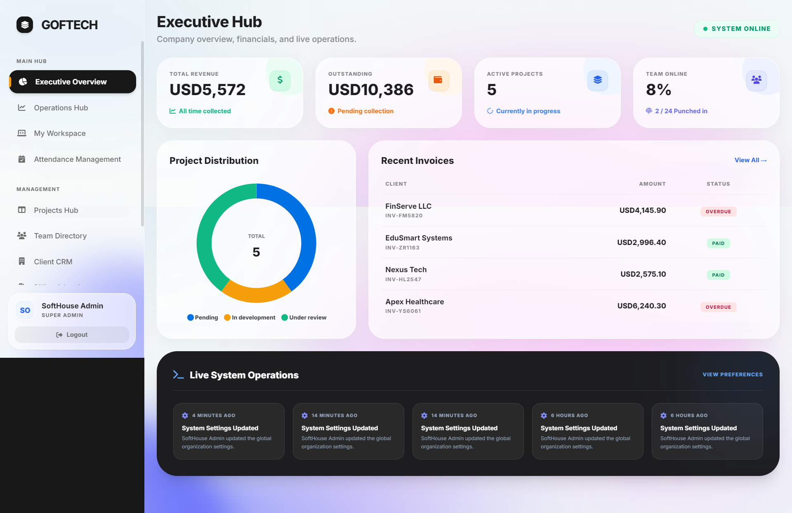
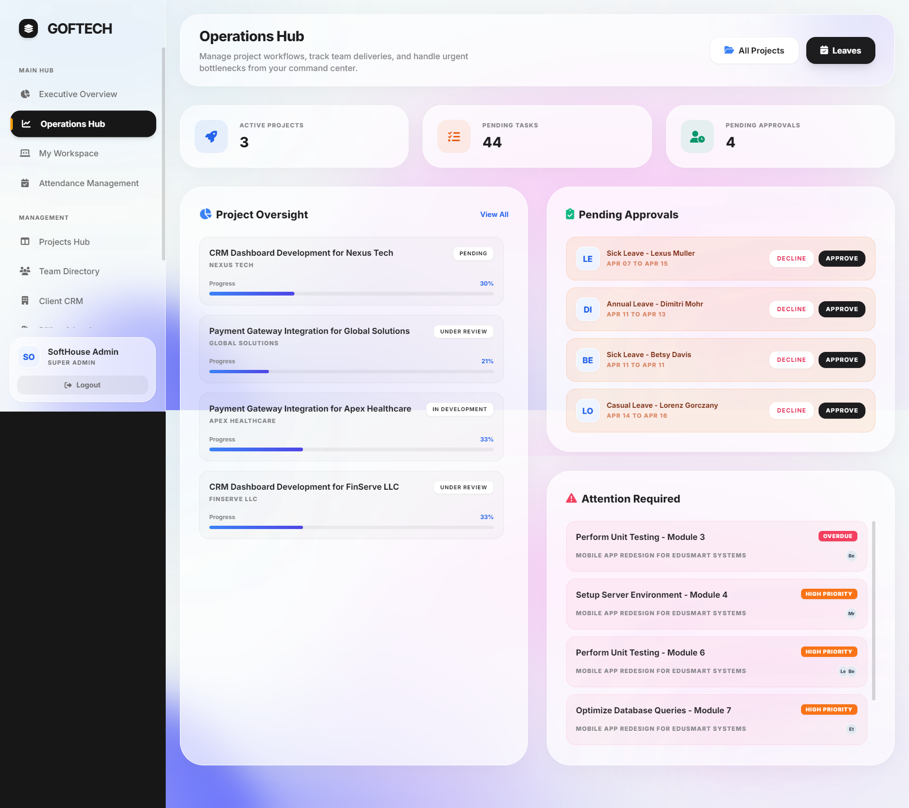
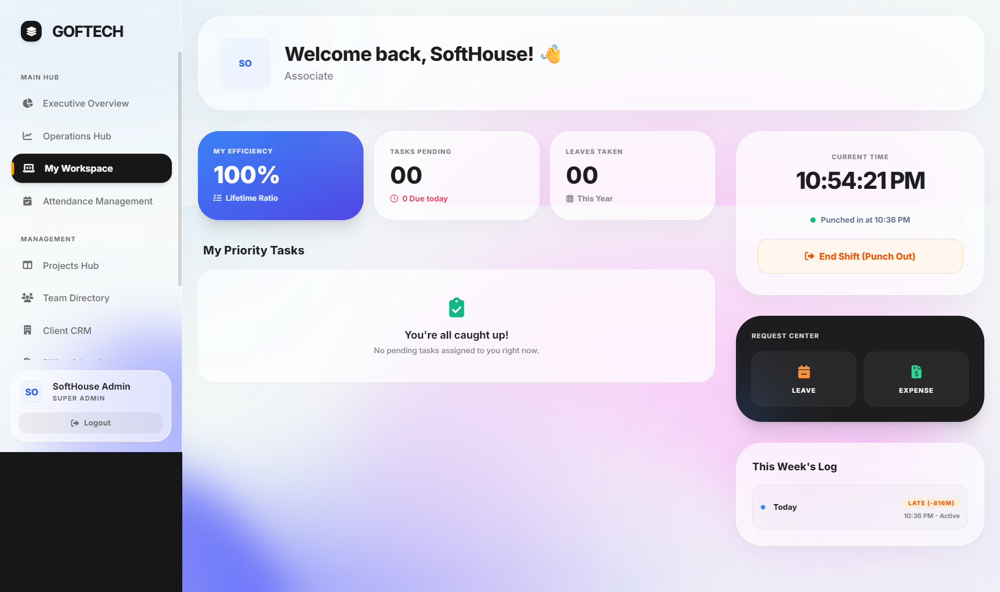
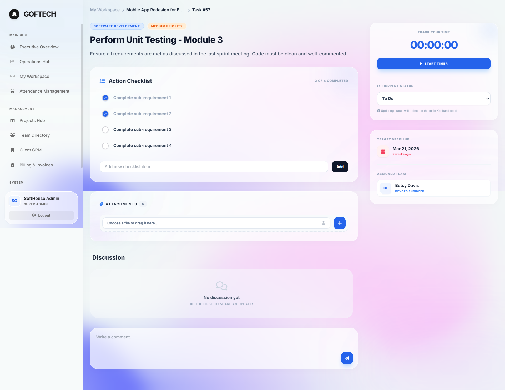
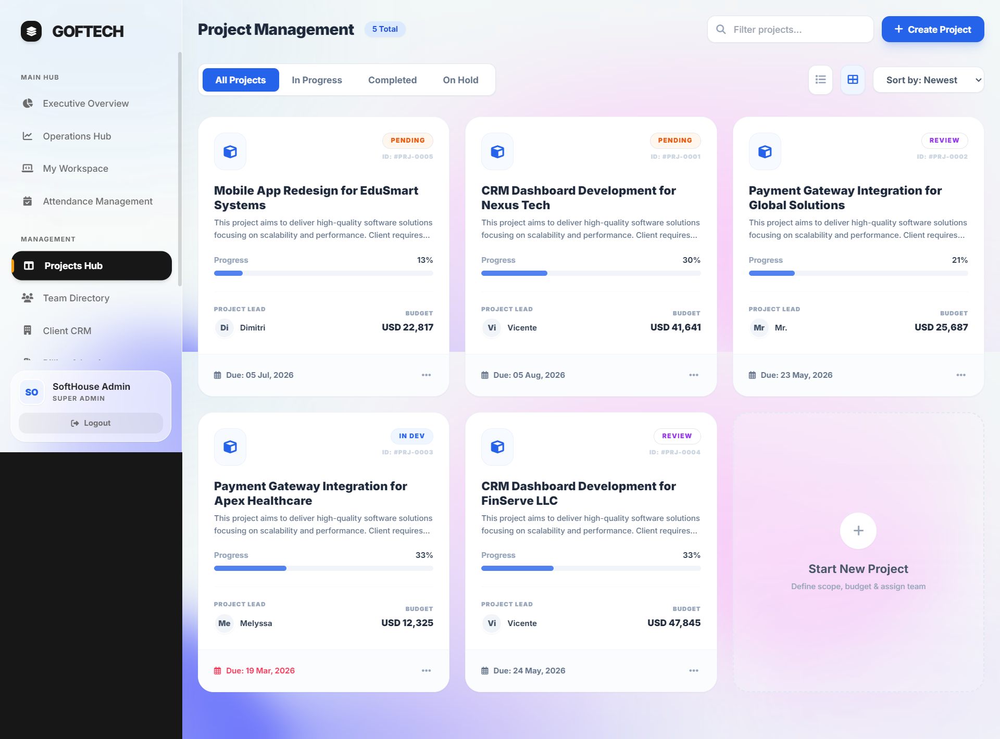
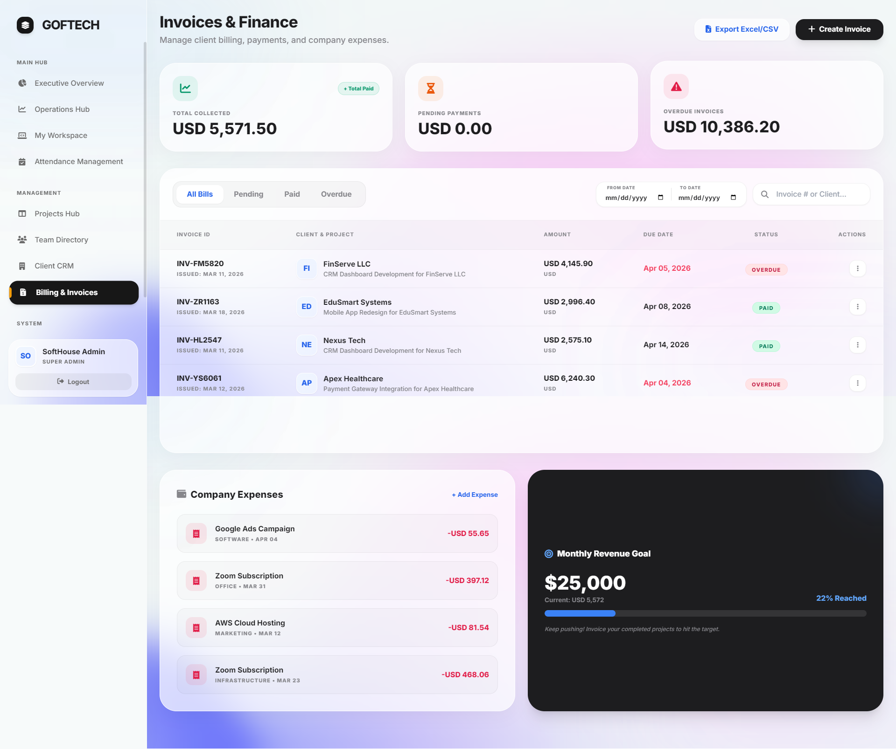
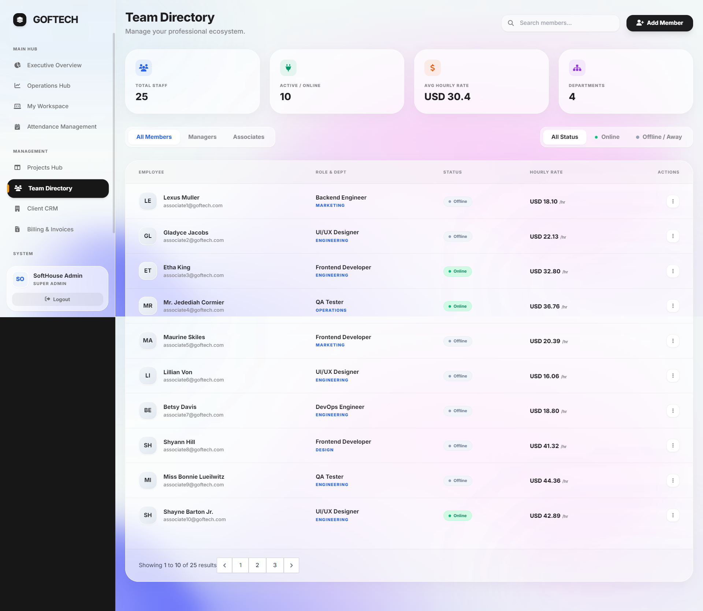
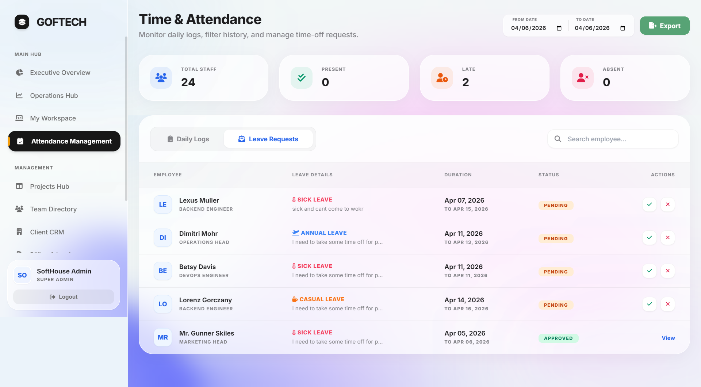

<div align="center">

# 🚀 GOFTECH Workspace & ERP System
**A Next-Generation Enterprise Resource Planning & Workspace Management System**

[](https://laravel.com)
[](https://laravel-livewire.com)
[](https://tailwindcss.com)
[](https://alpinejs.dev)
[](https://www.mysql.com)

An advanced, full-stack ERP solution built to streamline operations, manage human resources, track real-time productivity, and handle client billing—all wrapped in a premium, glass-morphism UI.

[Explore Features](#-key-features) • [Showcase](#%EF%B8%8F-ui-showcase) • [Tech Stack](#%EF%B8%8F-tech-stack) • [Installation](#-installation)

</div>

---

## ⚡ Overview

The **GOFTECH Workspace & ERP** is a centralized platform designed to replace fragmented tools. It brings Project Management, Human Resources (HRMS), Time Tracking, and Financial Operations under one unified, lightning-fast dashboard. Engineered with the robust **TALL Stack**, it offers reactive, real-time interfaces without the overhead of heavy SPA frameworks.

---

## ✨ Key Features

- **📊 Advanced Project & Task Management:** Agile-inspired Kanban boards, sub-task checklists, priority flagging, and seamless file attachments.
- **⏱️ Real-Time Time Tracking:** A custom Alpine.js + Livewire engine that tracks active task hours, syncing directly to employee performance metrics and project budgets.
- **👥 Intelligent HRMS:** Automated attendance logging, leave request workflows, and a dynamic algorithm that calculates an *'Overall Employee Rating'* based on punctuality and task completion rates.
- **💰 CRM & Finance:** Client directory management, dynamic billing setups, and invoice generation based on logged hours and project scopes.
- **🎨 Premium UI/UX:** iOS-inspired glass-morphism design, smooth transitions, and a highly responsive layout for desktop and mobile.

---

## 🖼️ UI Showcase

Here is a glimpse into the sophisticated interface and powerful modules of the system:

### Dashboards & Overviews
<p align="center">
  
  
</p>

### Workspace & Task Management
<p align="center">
  
  
</p>

### Projects & Finance
<p align="center">
  
  
</p>

### HRMS (Attendance, Leaves & Performance)
<p align="center">
  
  
</p>

<p align="center">
  
</p>

---

## 🛠️ Tech Stack

- **Framework:** Laravel 11 (PHP 8.2+)
- **Frontend/Reactivity:** Livewire 3 & Alpine.js
- **Styling:** Tailwind CSS (Custom Configuration)
- **Database:** MySQL
- **Assets:** Vite
- **Icons:** FontAwesome

---

## 🚀 Installation & Setup

Want to run this locally? Follow these steps:

1. **Clone the repository:**
   ```bash
   git clone [https://github.com/farhadnazir/softhousepro-crm-hrm.git](https://github.com/farhadnazir/softhousepro-crm-hrm.git)
   cd softhousepro-crm-hrm
Install Composer & NPM Dependencies:

```bash
composer install
npm install && npm run build 
```

Environment Setup:

```bash
cp .env.example .env
php artisan key:generate
(Update your .env file with your local database credentials)
```
Run Migrations & Seeders:

```bash
php artisan migrate --seed
```
Start the Development Server:

```bash
php artisan serve
```
👨‍💻 Developed By
Farhad Nazir
Full-Stack Software Engineer | Founder @ Techwine Solutions

🌐 GitHub Profile: https://www.github.com/farhadnazir

💼 LinkedIn Profile: https://www.linkedin.com/in/farhadnazir

“Architecting systems that don't just work, but scale beautifully.”

<div align="center">
<p>Show some ❤️ by starring this repository!</p>
</div>
